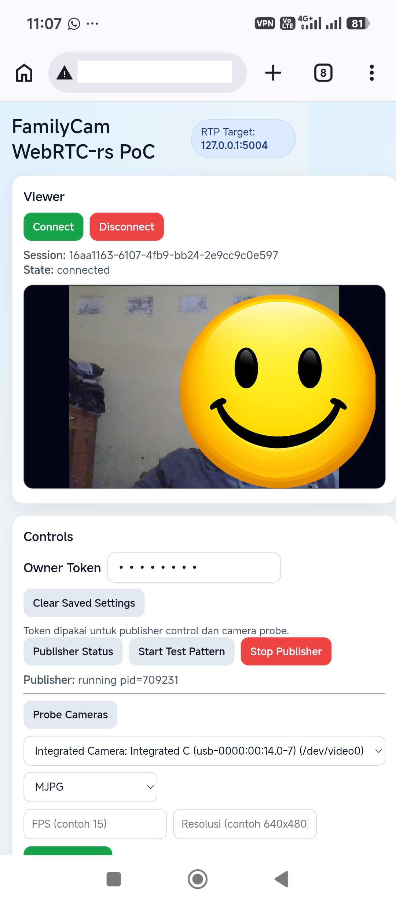

# FamilyCam (On-Demand Home Monitor) Workspace

Repo ini dipisah menjadi jalur stabil (`main-app`) dan jalur eksperimen (`webrtc-experiment`) supaya keduanya bisa berkembang tanpa saling merusak.

## Kenapa Proyek Ini Dibuat
Saya membuat aplikasi ini untuk memanfaatkan barang/perangkat yang sudah ada di rumah untuk kebutuhan sendiri, khususnya monitoring keluarga secara sederhana, hemat biaya, dan tetap privat.

## Etika Penggunaan
Jika kamu ingin memakai repo ini, gunakan untuk tujuan yang baik, legal, dan bertanggung jawab.

Saya tidak bertanggung jawab atas penggunaan aplikasi ini untuk aktivitas yang melanggar hukum, merugikan orang lain, atau tujuan tidak baik.

## Preview


## Tech Stack (Ringkas)
- Bahasa utama: Rust
- Backend web: `axum`, `tokio`
- Pipeline kamera/media: `ffmpeg`, `v4l2`
- Main app streaming: MJPEG over HTTP (single-client)
- Eksperimen streaming: WebRTC (`webrtc-rs`) + RTP ingest
- Frontend: HTML/CSS/JavaScript vanilla
- Deploy Linux: `systemd` service

## 1) Main App (Stabil)
Lokasi:
- `projects/main-app`

Isi:
- backend + UI FamilyCam produksi ringan (MJPEG on-demand)
- auth, start/stop, snapshot, camera probe/select runtime
- dokumen implementasi dan deployment systemd

Jalankan:
```bash
cd projects/main-app
cargo run
```

## 2) WebRTC Experiment (PoC)
Lokasi:
- `projects/webrtc-experiment`

Isi:
- `webrtc-rs-poc` (aplikasi runnable)
- dokumentasi publik terkait eksperimen

Status terbaru PoC:
- signaling WebRTC (`offer/candidate`)
- RTP ingest UDP ke `TrackLocalStaticRTP`
- helper publisher ffmpeg (`start/stop/status`)
- camera probe endpoint (`/camera/probe`)
- UI dashboard 2 kolom (viewer + controls)
- persist setting UI via `localStorage` + tombol `Clear Saved Settings`

Jalankan:
```bash
cd projects/webrtc-experiment/webrtc-rs-poc
cargo run
```

## Lisensi
lisensi untuk repo ini: **Apache-2.0**.

File lisensi ada di [LICENSE](/home/iwan/Project/family-cam-on-demand-home-monitor/LICENSE).
