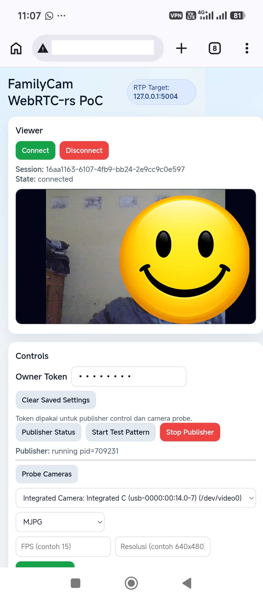
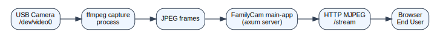
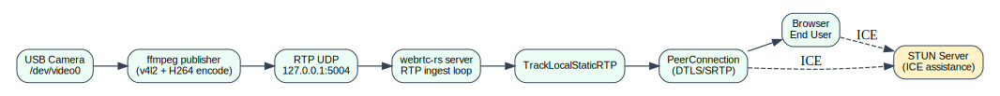

# FamilyCam (On-Demand Home Monitor) Workspace


Repo ini dipisah menjadi jalur stabil (`main-app`) dan jalur beta (`beta-webrtc-rs`, `beta-go-pion`, `beta-android-viewer`) supaya keduanya bisa berkembang tanpa saling merusak.

## Kenapa Proyek Ini Dibuat
Saya membuat aplikasi ini untuk memanfaatkan barang/perangkat yang sudah ada di rumah untuk kebutuhan sendiri, khususnya monitoring keluarga secara sederhana, hemat biaya, dan tetap privat.

## Etika Penggunaan
Jika kamu ingin memakai repo ini, gunakan untuk tujuan yang baik, legal, dan bertanggung jawab.

Saya tidak bertanggung jawab atas penggunaan aplikasi ini untuk aktivitas yang melanggar hukum, merugikan orang lain, atau tujuan tidak baik.

## Preview


## Diagram Arsitektur
- Alur data kamera ke end-user ada di [docs/DATAFLOW.md](/home/iwan/Project/family-cam-on-demand-home-monitor/docs/DATAFLOW.md)
- Main app flow:
  
- WebRTC PoC flow:
  

## Tech Stack (Ringkas)
- Bahasa utama: Rust
- Backend web: `axum`, `tokio`
- Pipeline kamera/media: `ffmpeg`, `v4l2`
- Main app streaming: MJPEG over HTTP (single-client)
- Eksperimen streaming: WebRTC (`webrtc-rs`) + RTP ingest
- Frontend: HTML/CSS/JavaScript vanilla
- Deploy Linux: `systemd` service

## 1) Main App (Stabil)
Lokasi:
- `projects/main-app`

Isi:
- backend + UI FamilyCam produksi ringan (MJPEG on-demand)
- auth, start/stop, snapshot, camera probe/select runtime
- dokumen implementasi dan deployment systemd

Jalankan:
```bash
cd projects/main-app
cargo run
```

Troubleshooting kamera cepat:
```bash
cd /home/iwan/Project/family-cam-on-demand-home-monitor
scripts/check-camera.sh
```

## 2) WebRTC Rust (Beta)
Lokasi:
- `projects/beta-webrtc-rs`

Isi:
- `webrtc-rs-poc` (status: Beta)
- dokumentasi publik terkait implementasi WebRTC

Status terbaru:
- signaling WebRTC (`offer/candidate`)
- RTP ingest UDP ke `TrackLocalStaticRTP`
- helper publisher ffmpeg (`start/stop/status`)
- camera probe endpoint (`/camera/probe`)
- UI dashboard 2 kolom (viewer + controls)
- persist setting UI via `localStorage` + tombol `Clear Saved Settings`

Jalankan:
```bash
cd projects/beta-webrtc-rs/webrtc-rs-poc
cargo run
```

## 3) WebRTC Go + Android (Beta)
Lokasi:
- `projects/`

Isi:
- `beta-go-pion` (status: Beta)
- `beta-android-viewer` (status: Beta)

Jalankan:
```bash
cd projects/beta-go-pion
cp .env.example .env
go mod tidy
go run .
```

## Lisensi
lisensi untuk repo ini: **Apache-2.0**.

File lisensi ada di [LICENSE](/home/iwan/Project/family-cam-on-demand-home-monitor/LICENSE).
