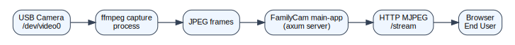
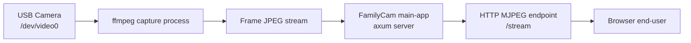
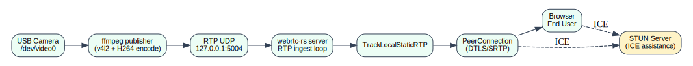
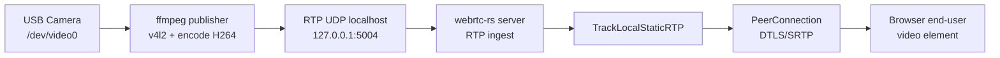

# FamilyCam Data Flow

Dokumen ini menjelaskan alur data dari kamera sampai tampil di layar end-user.

## 1) Main App (MJPEG over HTTP)

Versi gambar:





Urutan ringkas:
1. Kamera diambil oleh `ffmpeg`.
2. Frame JPEG diteruskan ke server main-app.
3. Browser menerima stream MJPEG via HTTP.

## 2) WebRTC Experiment (webrtc-rs PoC)

Versi gambar:





Urutan signaling + media:

```mermaid
sequenceDiagram
    participant U as User Browser
    participant S as FamilyCam WebRTC Server
    participant ST as STUN Server
    participant F as ffmpeg Publisher

    U->>S: GET / (load UI)
    U->>S: POST /webrtc/offer
    S-->>U: SDP answer
    U->>S: POST /webrtc/candidate
    U->>ST: STUN request
    S->>ST: STUN request
    U<->>S: ICE checks + DTLS handshake

    U->>S: POST /publisher/start?token=...
    S->>F: spawn ffmpeg
    F->>S: RTP ke 127.0.0.1:5004
    S-->>U: Video SRTP (WebRTC)
    U->>U: Render di <video>
```

Catatan:
- `POC_ICE_SERVERS` (contoh `stun:stun.l.google.com:19302`) dipakai untuk membantu ICE menemukan jalur koneksi.
- Jika direct path sulit (CGNAT/mobile tertentu), biasanya perlu TURN agar lebih stabil.

## Format yang tersedia di repo
- Source diagram: `docs/diagrams/*.dot` (Graphviz)
- Gambar vektor: `docs/images/*.svg` (paling cocok untuk README/GitHub)
- Gambar raster: `docs/images/*.png` (cocok untuk share chat/presentasi)
